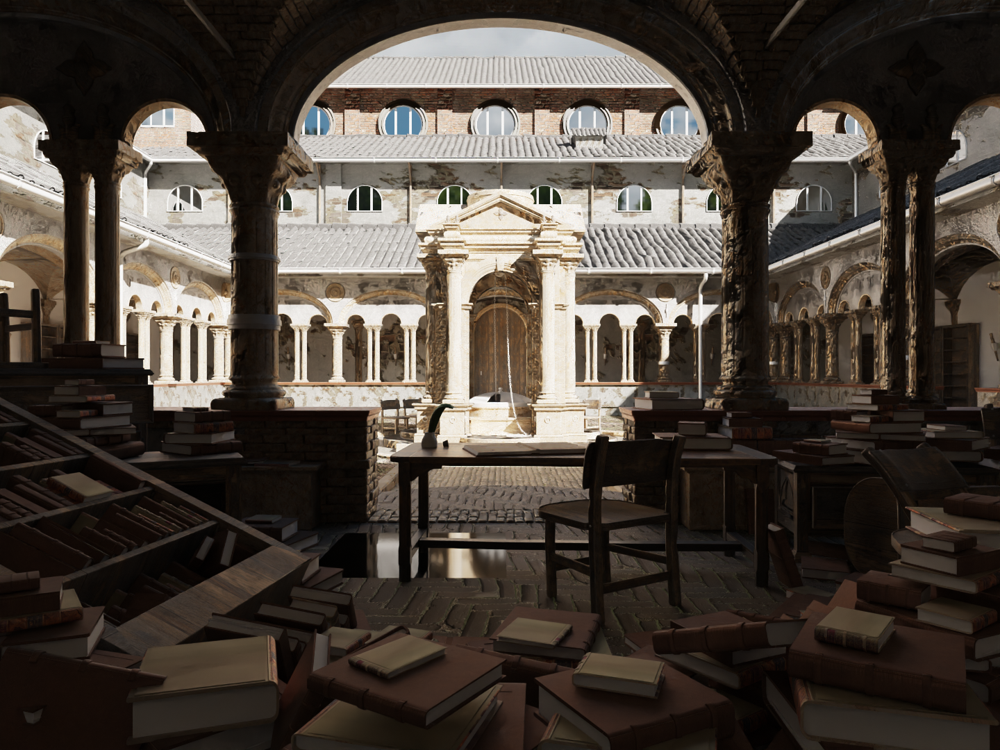
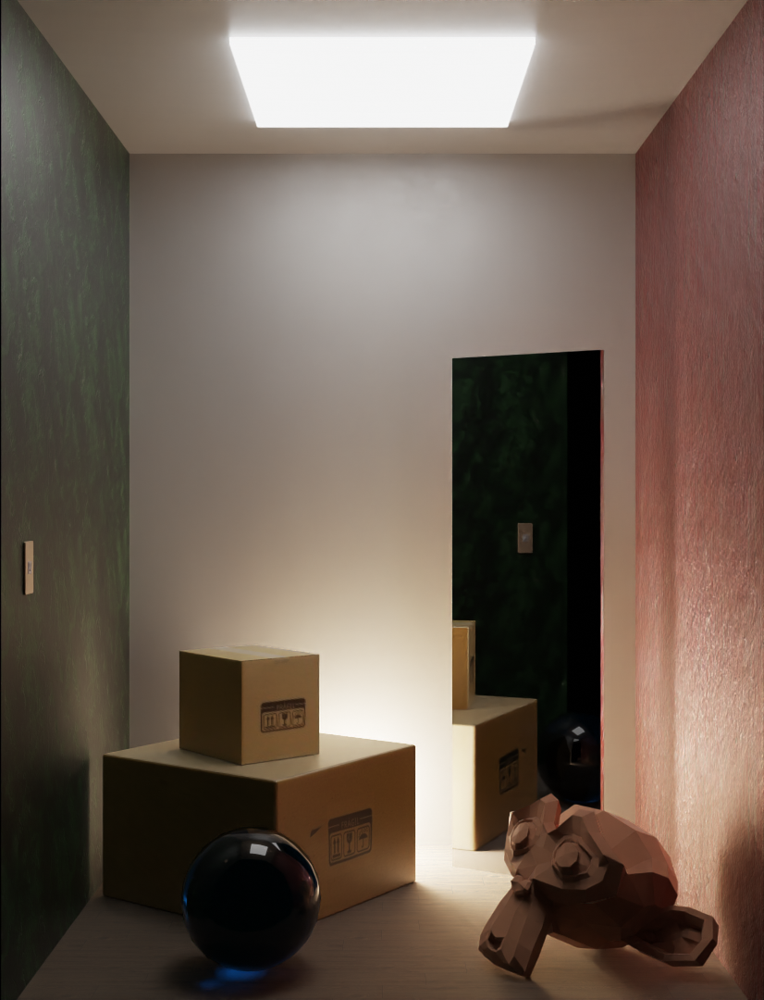

# Tracey
A minimal progressive CPU raytracer.  

| | | | |
| - | - | - | - |
|  |  |  |  |

## Building
**Currently, you can only build for Linux.** There is a [testing branch](https://github.com/Icemonster0/Tracey/tree/mac-test) for Mac.  

To compile the source code, use CMake:
```
cmake -S path/to/Tracey -B path/to/build/dir
cd path/to/build/dir
make
```
where `path/to/Tracey` should be the directory in which `CMakeLists.txt` can be found.  

To be able to compile, you need
- CMake & make
- a C++ compiler with C++17 support
- GL library
- openmp library

(The latter two of which are usually installed (on Linux) if you have g++ (I think))  

## Usage
Run Tracey with the option `-S` to specify the scene file to be loaded. You can use the examples in [`scenes`](scenes). You can also write your own scene description files using the syntax described in [`tracey_syntax.md`](tracey_syntax.md).  

For example:  
```
Tracey -S scenes/example.tracey
Tracey -S scenes/example1.glb
```

To render from the camera's point of view (the one that is specified in the scene description), use the flag `-r`. This skips the interactive window and prints minimal render info to the console. If you're doing this, I recommend to also set the image size (`-rs '<w> <h>'`) and number of samples (`-s <n>`).

All other command line options can be found by running `Tracey help`.  
Camera navigation and rendering controls are displayed in the console during runtime.

## Credits
Thanks to *Carlo Bergonzini / Monorender* for the "lone monk" scene!
